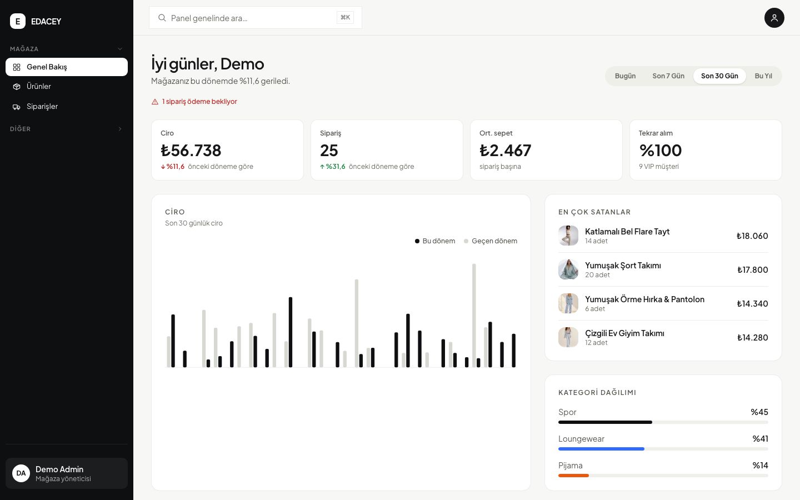
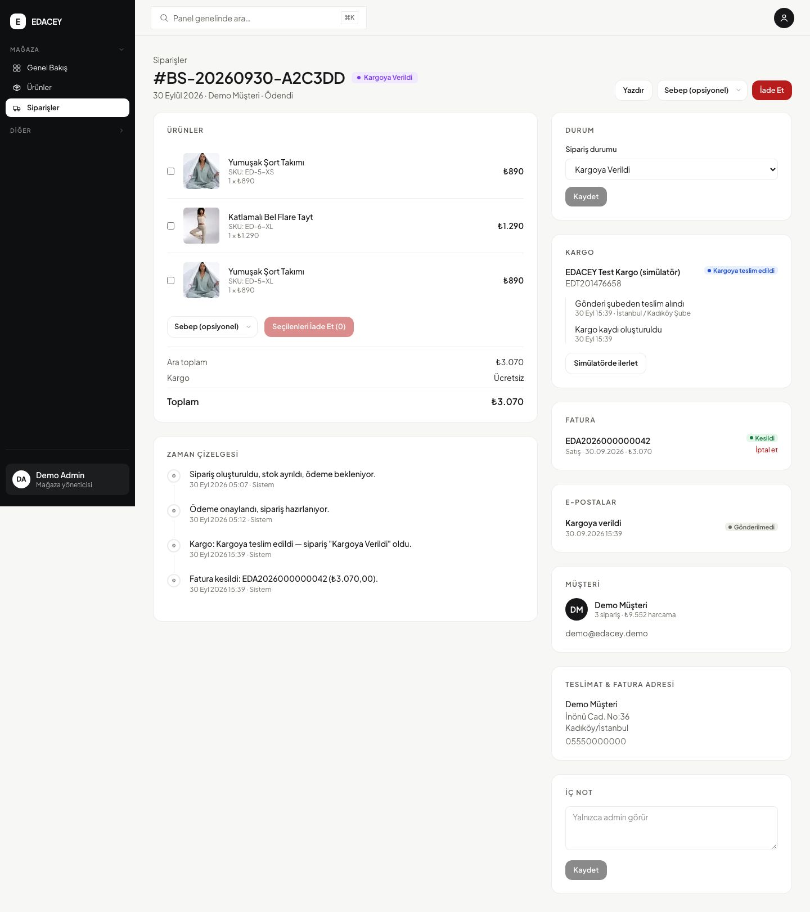
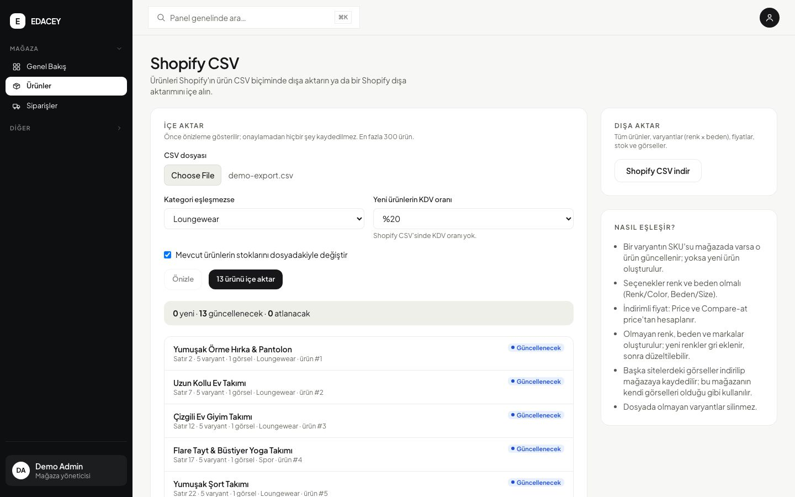
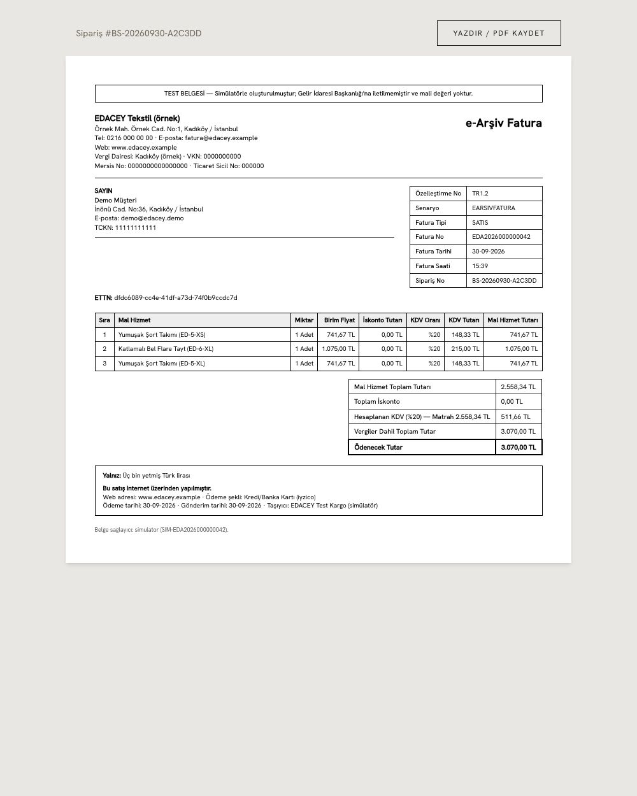
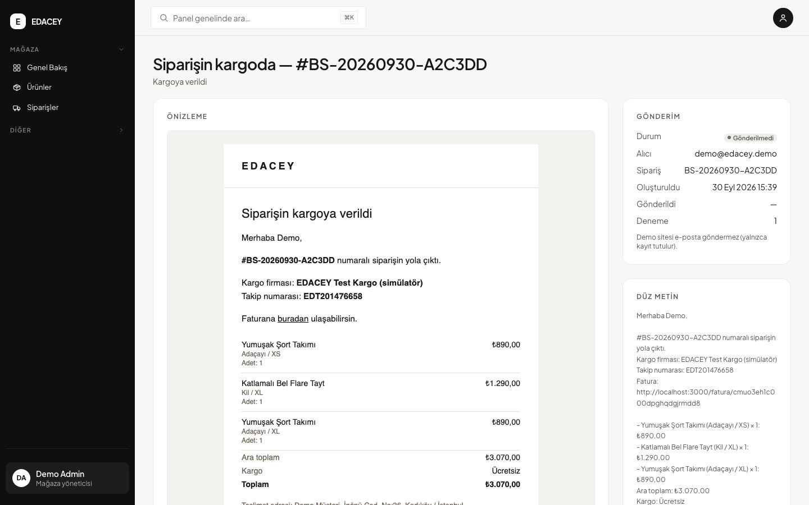

# EDACEY — uçtan uca e-ticaret sistemi

Loungewear, spor giyim ve pijama satan bir markanın mağazası ve yönetim
paneli; sıfırdan, bir e-ticaret sisteminin arka planını baştan sona öğrenmek
için geliştirildi. Ürün ve varyant yönetimi, stok rezervasyonu, iyzico ile
ödeme, kargo takibi, e-Arşiv fatura ve KDV, iade, bilgilendirme e-postaları
ve Shopify ile uyumlu ürün aktarımı — hepsi çalışan tek bir uygulamada.

> Kişisel portföy projesi; gerçek bir şirketle bağlantısı yok. Ödemeler
> iyzico'nun test (sandbox) ortamında alınır, faturalar bir simülatörle
> üretilir ve Gelir İdaresi'ne gönderilmez.

**Canlı demo:** yakında. Demo sitede giriş sayfaları hazır demo hesaplarını
gösterir; her şey denenebilir, veriler her gece sıfırlanır.

| Mağaza | Yönetim paneli |
| --- | --- |
|  |  |
|  |  |
|  |  |

| e-Arşiv fatura | Müşteriye giden e-posta | Mobil |
| --- | --- | --- |
|  |  |  |

## Neler var

**Mağaza**
- Kategori sayfaları, veritabanında çalışan arama ve filtreler (beden, renk,
  fiyat, stok), sıralama, sayfalama; Türkçe karakterlere duyarsız arama
  ("tisort" → "Tişört").
- Renk × beden varyantlı ürün sayfası, beden rehberi, favoriler, yorumlar
  (admin onaylı, "doğrulanmış alışveriş" etiketi).
- Sepet, adres defteri, ayrı teslimat ve fatura adresi, kupon ve otomatik
  kampanya indirimi, iyzico ile ödeme.
- Hesabım: siparişler ve kargo takibi, fatura bağlantıları, sipariş iptali,
  şifre değiştirme ve e-postayla şifre sıfırlama.

**Sipariş, ödeme ve stok**
- Ödeme sayfasına geçerken stok ayrılır; ödeme yapılmazsa süre dolunca geri
  bırakılır. Stok bittiği için gönderilemeyecek bir siparişin ödemesi
  otomatik iade edilir.
- Her stok değişikliği bir stok hareketi olarak kaydedilir (mal kabul, satış,
  iade, iptal, rezervasyon, düzeltme); kritik stok uyarıları.

**Kargo**
- Anlaşmalı firmalar (Yurtiçi, Aras, MNG…) için takip numarası girişi;
  API'li bir kargo firmasını taklit eden simülatör, imzalı webhook'larla
  "teslim alındı → transferde → dağıtımda → teslim edildi" akışı.

**Fatura ve KDV**
- Sipariş kargoya verilince e-Arşiv satış faturası otomatik kesilir; iadede
  iade faturası, iptalde fatura iptali. Satır bazında KDV (%1/%10/%20),
  oran bazında matrah, tutarın yazıyla gösterimi, yazdırılabilir A4 fatura.

**E-posta**
- Sipariş alındı, kargoya verildi (takip ve fatura bağlantısıyla), teslim
  edildi, iptal ve iade e-postaları; şifre sıfırlama. Yönetim panelinde tüm
  e-postalar ve gönderim durumları, müşterinin gördüğü hâliyle önizleme.

**Yönetim paneli**
- Genel bakış (ciro, sipariş, sepet ortalaması, en çok satanlar), raporlar.
- Ürünler: tek sayfalık form, renk × beden matrisiyle otomatik varyant ve
  SKU, görsel yükleme, "kart kontrolü" (eksik alan uyarıları), yapay zekâ ile
  açıklama / SEO / görsel alt metni taslağı (Gemini ya da Claude).
- Siparişler: durum yönetimi, kargoya verme, fatura kesme/iptal, tam ve
  kısmi iade (iyzico), zaman çizelgesi, CSV dışa aktarma.
- Kampanyalar, kuponlar, kategoriler, koleksiyonlar, renk/beden/beden
  tabloları, yorum moderasyonu, müşteriler, iadeler, push bildirimleri.
- **Shopify CSV:** kataloğu Shopify'ın ürün CSV biçiminde dışa aktarma; bir
  Shopify dışa aktarımını önizleyerek içe alma (mevcut ürünler SKU'dan
  eşleşir, kopya oluşmaz).

## Zor kısımlar ve nasıl çözüldü

E-ticarette asıl iş ürün sayfası değil; paranın, stoğun ve belgelerin her
adımda tutarlı kalması. Projenin en çok şey öğreten parçaları:

- **Aynı son ürünü iki kişi alamasın.** Stok, ödeme sayfasına geçerken satır
  kilidiyle ayrılır; ödeme gelmezse süresi dolan rezervasyon geri bırakılır,
  ödeme geç gelir ve stok tükenmişse para otomatik iade edilir. Ürünün toplam
  stoğunu varyantlardan veritabanı tetikleyicisi hesaplar, kod unutsa bile
  bozulmaz. → [`stock-reservation.ts`](src/lib/stock-reservation.ts),
  [`stock_reservation` migration'ı](prisma/migrations/20260929164345_stock_reservation/migration.sql)
- **Ödeme bildirimine körü körüne güvenmemek.** iyzico'nun geri dönüşündeki
  token'a tek başına güvenilmez: ödeme sunucudan yeniden sorgulanır, imza ve
  tutar doğrulanır; aynı bildirim iki kez gelse de sipariş bir kez işlenir.
  Fiyatlar her zaman sunucuda yeniden hesaplanır. →
  [`checkout/callback`](src/app/%28site%29/checkout/callback/route.ts)
- **Fatura toplamı, çekilen tutarla kuruşu kuruşuna aynı.** Tüm hesaplar
  kuruş cinsinden tam sayıyla yapılır; KDV, KDV dahil tutardan geriye
  ayrılır; kupon indirimi farklı KDV oranlı satırlara "en büyük kalan"
  yöntemiyle dağıtılır. 1.000 rastgele sepetle test edildi. →
  [`invoicing/tax.ts`](src/lib/invoicing/tax.ts)
- **Fatura numarasında boşluk olmaz, kesilen fatura değişmez.** Numara, fatura
  ile aynı veritabanı işleminde bir sayaç satırından alınır (hata olursa
  numara yanmaz, aynı anda kesilen faturalar çakışmaz). Kesilmiş faturayı
  değiştirmeyi ya da silmeyi veritabanı tetikleyicileri reddeder; hata iptal
  ya da iade faturasıyla düzeltilir. →
  [`numbering.ts`](src/lib/invoicing/numbering.ts),
  [`invoices` migration'ı](prisma/migrations/20260930095947_invoices/migration.sql)
- **E-posta kaybolmasın, iki kez gitmesin.** E-posta, siparişi değiştiren
  işlemle aynı veritabanı işleminde kaydedilir (outbox), yanıt döndükten
  sonra gönderilir, başarısız olursa tekrar denenir. Her bildirimin tekil bir
  anahtarı var: kargo firması aynı webhook'u iki kez gönderse de müşteriye
  tek e-posta gider. → [`email/outbox.ts`](src/lib/email/outbox.ts)
- **Kargo webhook'ları.** HMAC imzasıyla doğrulanır, tekrar gelen olaylar
  yok sayılır, sıra dışı gelen olaylarda durum olay zamanına göre hesaplanır.
  → [`shipping/events.ts`](src/lib/shipping/events.ts),
  [`shipping/webhook.ts`](src/lib/shipping/webhook.ts)
- **Arama ve filtreler veritabanında.** Eskiden tüm kategori belleğe
  yükleniyordu; şimdi filtreleme, sayma, sıralama ve sayfalama Postgres'te,
  aksansız (`unaccent`) ve kelime başından eşleşen arama trigram indeksiyle.
  → [`catalog.ts`](src/lib/catalog.ts)
- **Dışarıdan görsel indirmek (SSRF).** CSV içe aktarmada sunucu, dosyada
  yazan adreslerden görsel indirir; iç ağa işaret eden adresler, yönlendirme
  zincirleri, büyük ya da görsel olmayan dosyalar reddedilir. →
  [`remote-image.ts`](src/lib/remote-image.ts)
- **Şifre sıfırlama.** Bağlantı 30 dakika geçerli ve tek kullanımlık,
  veritabanında yalnızca özeti tutulur, yanıt adresin kayıtlı olup
  olmadığını belli etmez. → [`password-reset.ts`](src/lib/password-reset.ts)
- **Testlerin bulduğu hatalar.** Uçtan uca testler, aynı anda oluşturulan iki
  ürünün aynı id'yi aldığını ([`product-ids.ts`](src/lib/product-ids.ts)) ve
  checkout'ta iki adres formunun alan kimliklerinin çakıştığını ortaya
  çıkardı; ikisi de düzeltildi.

## Teknolojiler

Next.js 16 (App Router, Server Components) · React 19 · TypeScript ·
PostgreSQL + Prisma 7 · Tailwind CSS 4 · Zustand · GraphQL (graphql-yoga +
urql, yorumlar) · iyzico · nodemailer · Web Push · Jest + React Testing
Library · Node test runner (gerçek veritabanı testleri) · Playwright

```
src/app/(site)       mağaza sayfaları
src/app/admin        yönetim paneli
src/app/api          API route'ları (admin, checkout, kargo webhook'u…)
src/app/fatura       yazdırılabilir fatura
src/lib              iş kuralları: stok, sipariş, fatura, e-posta, kargo, katalog…
prisma/              şema, migration'lar, seed
scripts/             zamanlanmış işler ve demo verisi
e2e/                 Playwright testleri
docs/                mimari notlar, ekran görüntüleri
```

Ayrıntılı mimari notlar: [`docs/mimari.md`](docs/mimari.md).

## Kurulum

Gerekenler: Node.js 20+, PostgreSQL 15+.

```bash
npm install
cp .env.example .env.local        # değerleri doldur (aşağıda)
createdb e_commerce               # DATABASE_URL'i buna göre ayarla
npx prisma migrate deploy --config prisma7.config.ts
npx prisma db seed --config prisma7.config.ts
npm run dev                       # http://localhost:3000
```

`.env.local` için:

| Değişken | |
| --- | --- |
| `DATABASE_URL` | Postgres bağlantısı |
| `AUTH_SECRET` | oturum imzası; `node -e "console.log(require('crypto').randomBytes(32).toString('base64'))"` |
| `SEED_ADMIN_EMAIL` / `SEED_ADMIN_PASSWORD` | seed'in oluşturacağı admin hesabı |
| `IYZICO_API_KEY` / `IYZICO_SECRET_KEY` | [iyzico sandbox](https://sandbox-merchant.iyzipay.com) test anahtarları (yoksa ödeme adımı hata mesajı verir) |
| `NEXT_PUBLIC_SITE_URL` | sitenin adresi (e-posta bağlantıları, sitemap) |
| `SHIPPING_WEBHOOK_SECRET` | kargo webhook imzası; production'da zorunlu |
| `SMTP_HOST` … `EMAIL_FROM` | e-posta gönderimi; boşsa e-postalar yalnızca panelde kaydedilir |
| `NEXT_PUBLIC_VAPID_PUBLIC_KEY` / `VAPID_PRIVATE_KEY` | push bildirimleri; `npx web-push generate-vapid-keys` |
| `GEMINI_API_KEY` ya da `ANTHROPIC_API_KEY` | yapay zekâ taslakları (opsiyonel) |
| `DEMO_MODE=1` | yalnızca herkese açık demo sunucusunda |

iyzico test kartı: `5528 7900 0000 0008`, son kullanma `12/30`, CVC `123`.

### Zamanlanmış işler

| Komut | Ne yapar | Sıklık |
| --- | --- | --- |
| `npm run emails:deliver` | gönderilemeyen e-postaları tekrar dener | 5 dakikada bir |
| `npm run cleanup:pending-orders` | süresi dolan stok rezervasyonlarını bırakır, yarım kalan siparişleri temizler | saatte bir |
| `npm run demo:reset` | tüm veriyi silip demo verisini yükler (`DEMO_MODE=1` olmadan çalışmaz) | her gece, yalnızca demo |

## Testler

```bash
npm test            # birim testleri (Jest + RTL) — 157 test
npm run test:db     # gerçek Postgres üzerinde: stok, kargo, arama, fatura, e-posta, CSV — 37 test
npm run test:e2e    # tarayıcıda uçtan uca akışlar (Playwright) — 22 test
npm run lint
```

`test:db` kendi test verisini oluşturup siler; fatura testleri gerçek
numaralara dokunmamak için ayrı bir seri (`TST`) kullanır. E2e testleri
seed'deki admin hesabıyla giriş yapar.

## Bilinen sınırlar

- Faturalar bir simülatörle üretiliyor; gerçek bir e-Arşiv entegratörü
  (ve GİB karekodu) yok, satıcı bilgileri örnek değerler. Yalnızca bireysel
  fatura var, kurumsal (VKN'li) fatura yok.
- Yalnızca simülatör kargo firması API'li; diğer firmalarda takip numarası
  elle girilir, teslim elle işaretlenir.
- Kısmi iadede iyzico'nun iade ettiği tutar, indirim ve kargo payının
  dağıtımı nedeniyle iade faturasındaki satır tutarından birkaç kuruş
  farklı olabilir; tam iadede toplamlar eşit.
- Şifre değişince diğer cihazlardaki açık oturumlar hemen kapanmaz (en geç
  2 saatte sona erer).
- Görsel indirmede DNS rebinding'e karşı adres sabitlenmiyor; özellik yalnızca
  adminlere açık.

---

**In English:** EDACEY is a full e-commerce system built from scratch to
learn how online retail works end to end — a storefront and admin panel
with colour × size variants, stock reservation at checkout, iyzico
payments, carrier tracking via signed webhooks, e-Arşiv (Turkish e-invoice)
sale and return invoices with correct VAT down to the cent, a transactional
email outbox, password reset and Shopify product CSV import/export. Built
with Next.js 16, React 19, TypeScript, PostgreSQL and Prisma; tested with
Jest, real-database integration tests and Playwright.
